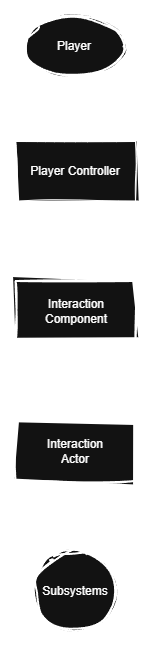

# Purpose

The interaction system manages communication between the player and world interaction objects. It detects valid interactable world objects, validates conditions, calls special interaction logic and routes execution to the appropriate actor and specialized systems while keeping the logic modular and reusable
# Responsibilities

	Detect available interactions
	Track active interaction components
	Validate interaction conditions
	Route execution to interaction actors and systems
	Provide consistent flow
# Out of Scope

# Communication

 
	
light version
 
	  
	

# Architecture Flow

 
	
light version
 
	  
	

# Dependencies

# Design Goals
