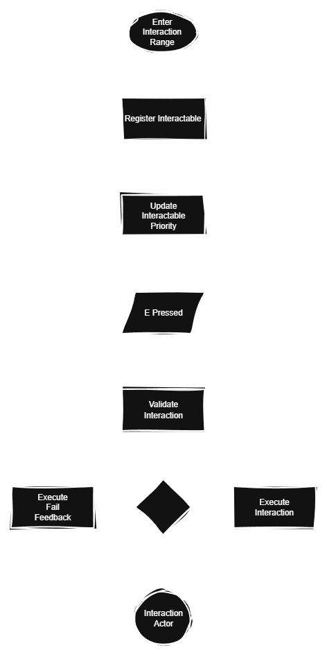
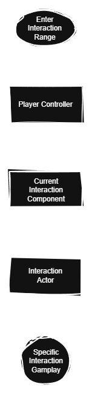

# Purpose

The interaction system manages communication between the player and world interaction objects. It detects valid interactable object, validates interaction conditions, calls special interaction logic and routes execution to the appropriate interaction actor while keeping the logic modular and reusable. Since validation is separated from gameplay, the same pipeline can be reused for all interaction types
# Responsibilities

	Detect interactable objects
	Keep track of active interaction targets
	Maintain interaction priority
	Validate conditions
	Route execution to interaction actors
# Out of Scope

	Inventory logic
	Dialogue logic
	Battle logic
	Execution of interaction gameplay
# Key Variables

	CurrentInteractComponent (BP_GeneralInteractComponent type)
	ActiveComponents (Array of BP_GeneralInteractComponent type)
# Execution Flow

 
	
light version
 
	  
	

# Communication Architecture

Player Controller owns the current interact component reference and the array of all overlapped
Interaction references are registered through collision overlap
Player Controller calls component when interaction starts
Interaction actors execute their own gameplay, communicating with Player Controller or managers
# Routing Logic

## Target Selection (actor overlap)

Interaction actors contain collision spheres
OnBeginOverlap component that belongs to the specific interaction actor is added to array
Interaction chosen based on priority
OnEndOverlap component is removed from the array and latest is again set
If there’s no active component, current interact component is set to none
## Validation (E pressed)

Function [CanInteract()](https://github.com/MungyPanda/REDACTED/blob/main/REDACTED_documentation/01aaa_Functions.md) inside of the current interact component is called
Special action handler lock is checked
If required special action is executed via handler
Key item lock is checked
If required inventory is checked for the item and quantity
## Execution (after validation)

Specific component owner interaction action or fail feedback is executed based on the results of validation. Interaction system does not participate in gameplay logic, only validates and tells the interaction actor what should follow next
# Architecture Overview

 
	
light version
 
	  
	

# Dependencies

	Player Controller
	Interaction component
	Interaction actors
	Collision overlap events
	Game states
# Design Goals

	Modular
	Actor independent
	Extendable
	Reusable flow
	Data driven configuration
# Notes
